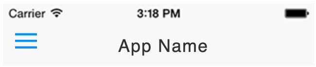

# Navigation titles

### **Overview**

If your app is configured to have an Android ActionBar and iOS Navigation Bar \(i.e. if you are using Sidebar Navigation, Navigation Hierarchy, or Native Search Form\), you may want to configure the text or image that shows in that space.

By default, your app name will appear in this space as shown below. You may upload a navigation header image under [Navigation Styling](../navigation-styling/navigation-titles-styling.md), or specify different text for different pages using the configuration below.

### **Configuration**

You may specify titles for each URL in your app using regular expressions.

Regex matches are prioritized top to bottom. If no match is found, your app name will be shown.

### **Learn more**

* [RegExr - Regex configuration resource](http://www.regexr.com/)
* [Example JSON for BooyaFitness.com](https://gonative.io/docs/booyafitness_navStructure_titles_example.json)

