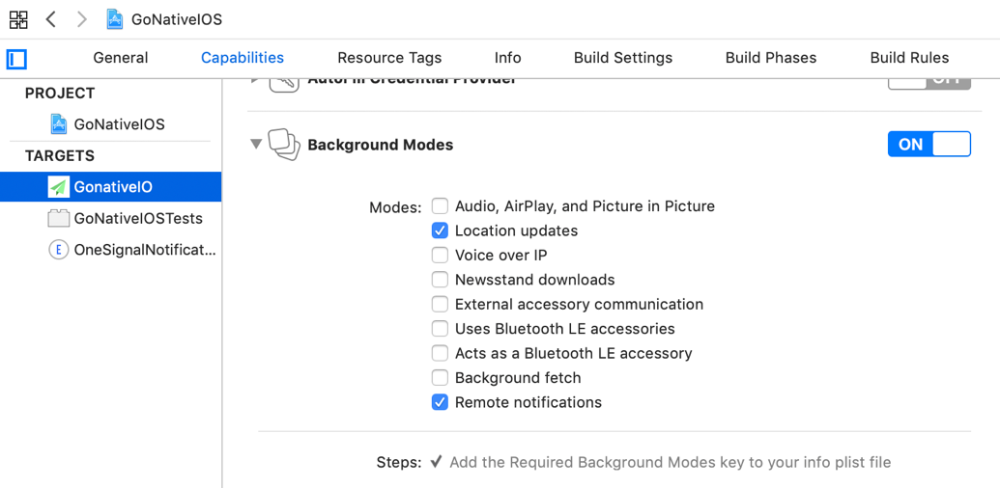

# Background location services

_Once the premium module has been added to your app, you may use the following APIs to access its functionality_

.

## Overview

By default, GoNative apps have access to the HTML5 geolocation APIs to retrieve the user’s current location, and to subscribe to location update changes. The HTML5 geolocation APIs have a few limitations:

* When the app is paused / backgrounded, location updates may be paused. Updates will typically be resumed when the app is brought back to the foreground, but the device’s movements when the was paused are lost.
* Javascript is paused when the app is backgrounded, preventing any processing of new locations.

The GoNative background location APIs described below allow for javascript to receive missing location updates when the app is temporarily backgrounded. It also supports uploading location updates to a server for intelligent background processing.

When background location is active on iOS, the app may modify the device’s status bar to indicate it is using the device location. This also provides a handy way for the user to return to the app by tapping the status bar.

Android requires that an ongoing service display a foreground notification. You may customize the title and text for this notification.

## Adding the capability in Xcode

In the Capabilities tab of your app, please enable Background Modes. Underneath, enable Location updates.



## Implementation Guide

To receive background location updates in javascript, create a javascript function to accept a batch of locations. It will be called with an object with the fields:

·      locations: an array of location objects

A location object has the following fields. Fields are not all guaranteed to be populated and may be null or undefined.

* timestamp: time of this location update, in seconds since Jan 1 1970
* latitude: the latitude in degrees
* longitude: the longitude in degrees
* altitude: the altitude in meters
* floor: \(iOS only\) the floor of the building in which the user is located
* horizontalAccuracy: in meters
* verticalAccuracy: in meters
* speed: instantaneous speed of the device in meters per second
* speedAccuracy: \(Android only\) in meters per second
* bearing: the direction of device movement, in degrees clockwise from north. Has a range of \[0.0, 360.0\]
* bearingAccuracy: \(Android only\) in degrees

To start background location scanning, open the url `gonative://backgroundLocation/start?data=DATA`. Replace DATA with a url-encoded JSON object with the following fields:

* callback: \(optional if postUrl is provided\) the javascript function name that you have defined to get the location updates. 
* postUrl: \(optional if callback if provided\) a url to which location updates will be POSTed as a JSON object. Note that the updates will typically not be sent with the same cookies as the user’s webview session, so please embed any necessary identifiers or authentication tokens in this url.

There are several parameters used on iOS:

* iosBackgroundIndicator: \(default false\) on iOS, modifies the status bar when the app is backgrounded to indicate the app is using location. Provides a quick way to return to the app. 
* iosPauseAutomatically: \(default true\) on iOS, allows the automatic pausing of location updates when the location is unlikely to change. 
* iosDistanceFilter: \(in meters, default 0.0\) on iOS, do not update location if the device has moved less than this distance since the last update 
* iosDesiredAccuracy: a string to indicate the desired accuracy. Choosing lower accuracy enhances battery life. 
  * best: \(default\) the best accuracy available 
  * bestForNavigation: The highest possible accuracy that uses additional sensor data to facilitate navigation apps. 
  * tenMeters: Accurate to within ten meters of the desired target. 
  * hundredMeters: Accurate to within one hundred meters. 
  * kilometer: Accurate to the nearest kilometer. 
  * threeKilometers: Accurate to the nearest three kilometers. 
* iosActivityType: a string that helps inform the behavior of automatic location pausing when iosPauseAutomatically is enabled. 
  * other: \(default\) unknown activity 
  * automotiveNavigation: The location manager is being used specifically during vehicular navigation to track location changes to the automobile. 
  * otherNavigation: The location manager is being used to track movements for other types of vehicular navigation that are not automobile related. 
  * fitness: The location manager is being used to track fitness activities such as walking, running, cycling, and so on. 
  * airborne: The location manager is being used specifically during airborne activities.

Android-specific parameters:

* androidInterval: the rate in milliseconds the app would prefer to receive updates. Actual update interval may be fast or slower. 
* androidFastestInterval: the fastest rate in milliseconds the app can receive updates. Actual interval update may be slower. 
* androidPriority: a string that gives the device a strong hint as to which location sources to use. 
  * highAccuracy: most likely to use GPS 
  * balanced: precision approximately within a city block, or 100 meters. Likely to use WiFi and cell tower positioning. 
  * lowPower: city-level positioning, about 10 kilometers 
  * noPower: the app will not trigger any location updates, but will receive locations triggered by other apps 
* androidSmallestDisplacement: in meters, default 0. Like iOSDistanceFilter, set the minimum location change since the last update 
* androidNotificationTitle: the title for the notification that shows the user the app is using their location 
* androidNotificationText: the text for the notification

Location updates will also be sent to the callback function and/or postUrl while the app is in the foreground. When the app is in the background, updates to postUrl will continue but the javascript callback function will be paused. When the app is resumed, any location updates that the callback function missed are sent in a large batch.

As an example, you may use this javascript code to start background locations:

```javascript
function locationUpdated(data) {
	console.log('got location', data);
}

var locationRequest = {
	callback: 'locationUpdated',
	postUrl: 'https://example.com/location/user123?token=abcabc',
	iosBackgroundIndicator: true,
	iosPauseAutomatically: true,
	iosDesiredAccuracy: 'bestForNavigation',
	iosActivityType: 'automotiveNavigation',
	androidPriority: 'highAccuracy',
	androidNotificationTitle: 'Navigation',
	androidNotificationText: 'Tap to return to app'
};

window.location.href = 'gonative://backgroundLocation/start?data=' + 
    encodeURIComponent(JSON.stringify(locationRequest));

```

To stop location updates, open the url `gonative://backgroundLocation/stop`

